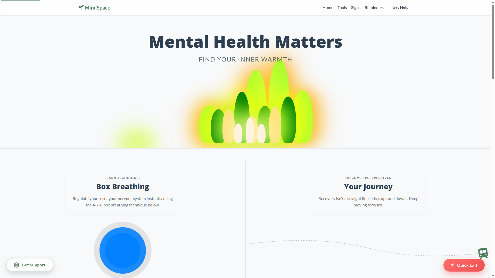
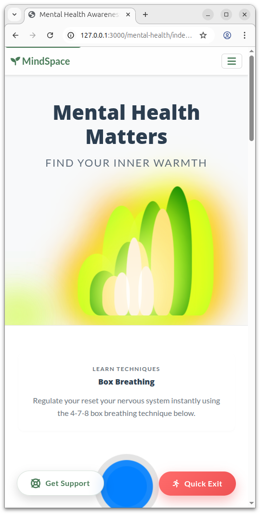
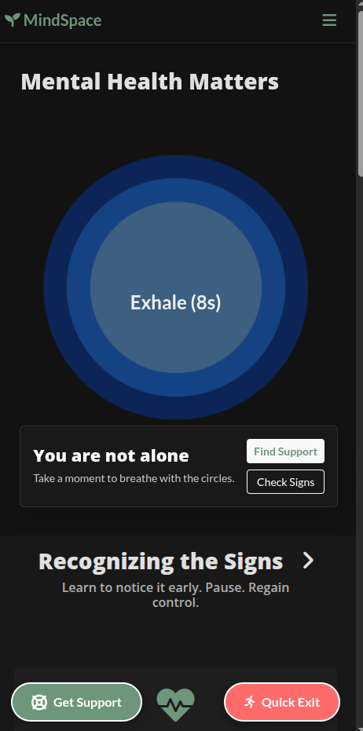
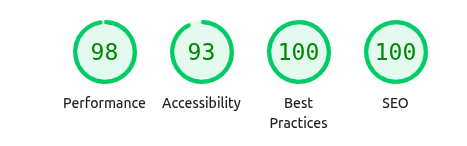

# MindSpace - Mental Health Awareness

**Live Demo:** https://sdri.github.io/mental-health/

<br/>



<div style="display: flex; justify-content: space-around; align-items: flex-start;">
  
  
</div>

<br/>

## 1. Project Overview

MindSpace is a responsive, accessible, single-page web application designed to raise awareness about mental health. It provides a safe digital environment for users to recognize common symptoms, learn simple coping strategies, and access support resources.

### 1.1 Purpose & Goals
*   **External User’s Goal:** To access quick, non-judgmental information, learn immediate stress-relief techniques (like the 4-7-8 breathing exercise), and find emergency contacts without friction or cognitive overload.
*   **Site Owner’s Goal:** To create a welcoming webpage that demonstrates front-end competency using HTML, CSS, and Bootstrap, while prioritizing accessibility (WCAG compliance) and a calming User Experience (UX).

---

## 2. User Experience (UX) Design

### 2.1 Design Strategy
The design philosophy centers on **"Calm Tech."**. Calming colors and modern CSS techniques, such as Glassmorphism and breathing animations, are used to provide a soothing, immersive experience rather than a static informational page.

### 2.2 Key Features & User Value

#### The "Breathing" Hero Section
*   **Feature:** An immediate visual guide for the 4-7-8 breathing technique using CSS animations.
*   **User Value:** Gives an overwhelmed user an immediate, actionable tool to regulate their nervous system upon landing on the site, without needing to read heavy text.

#### Optimized Responsive Imagery
*   **Feature:** Use of the HTML `<picture>` element and WebP formats.
*   **User Value:** Ensures the site loads instantly even on poor mobile connections, preventing user frustration during moments of distress.

#### Interactive Symptom Cards
*   **Feature:** Cards that react to hover states using CSS transitions and clear iconography.
*   **User Value:** Allows users to identify feelings (Physical, Emotional) through visual associations rather than dense medical text, making information easier to process.

#### CSS-Only Accordions
*   **Feature:** Native HTML `<details>` and `<summary>` elements for daily reminders.
*   **User Value:** Keeps the UI clean and uncluttered (Progressive Disclosure), allowing users to reveal information at their own pace.

#### "Quick Exit" Safety Button
*   **Feature:** A persistent, fixed-position button that immediately redirects to Google.
*   **User Value:** Provides safety and privacy for users who may be browsing in unsafe environments or need to hide their screen quickly.

#### Light / Dark mode based on system defaults
*   **Feature:** Uses the css media feature prefers-color-scheme to change default colors based on system defaults.
*   **User Value:** Both light mode and dark mode color schemes have advantages so it's good to give them the choice they prefer.

---

## 3. Technologies Used

### Core Stack
*   **HTML5:** Semantic markup for structure, utilizing tags like `<main>`, `<section>`, `<article>`, and `<details>` for accessibility.
*   **CSS3:** Custom properties (variables), Flexbox, Grid, Keyframe Animations, and Glassmorphism effects.
*   **Bootstrap 5.3:** Used for the rapid responsive grid system, buttons, and utility classes to ensure layout integrity across devices.

### Libraries & Assets
*   **FontAwesome 6:** For intuitive, screen-reader-friendly iconography.
*   **Google Fonts:** *Lato* (Body) for readability and *Open Sans* (Headings) for structure.
*   **Pexels:** Royalty-free stock imagery used for visual context.

---

## 4. Testing & Validation

### 4.1 Automated Validation
*   **W3C HTML Validator:** 0 Errors. Semantic nesting confirmed.
*   **Jigsaw CSS Validator:** 0 Errors. Vendor prefixes handled correctly.
*   **Lighthouse Audit:** High scores in Accessibility, Best Practices, and SEO. Minor suggestions were noted but deemed acceptable for this project scale.

   

### 4.2 Accessibility (a11y)
*   **Screen Readers:** Decorative icons use `aria-hidden="true"`. Interactive elements (like the Quick Exit button) use descriptive `aria-label` attributes.
*   **Color Contrast:** Text meets WCAG AA standards against background colors (verified via DevTools).
*   **Reduced Motion:** The site supports `prefers-reduced-motion`. If a user has animations disabled in their OS, the breathing orbs and smooth scrolling are automatically disabled via CSS media queries.

### 4.3 Responsive Manual Testing
The application was tested manually to ensure layout integrity:
1.  **Mobile (375px):** Stacked layout, readable text, functioning hamburger menu.
2.  **Tablet (768px):** Grid shifts to 2 columns, touch targets remain accessible.
3.  **Desktop (1200px+):** Full 3-column layouts, hover states active, breathing animations fully visible.

### 4.4 Browser Compatibility & Responsive Testing
The application was tested manually to ensure layout integrity across the following environments:

| Device Type | Viewport | Browser | Status |
|:-----------:|:--------:|:-------:|:------:|
| **Mobile** | 375px | Safari (iOS) | ✅ Pass |
| **Mobile** | 412px | Chrome (Android)| ✅ Pass |
| **Tablet** | 768px | Chrome (iPad) | ✅ Pass |
| **Desktop** | 1366px | Firefox | ✅ Pass |
| **Desktop** | 1920px | Edge/Chrome | ✅ Pass |

---

## 5. Deployment Guide

This project is optimized for deployment on cloud platforms like GitHub Pages.

1.  **Clone the Repository:**
    ```bash
    git clone https://github.com/sdri/mental-health.git
    ```
2.  **Navigate to Directory:**
    ```bash
    cd mental-health
    ```
3.  **Local Testing:**
    *   Open `index.html` in your browser to verify assets load correctly.
4.  **GitHub Pages Deployment:**
    *   Push your code to GitHub.
    *   Go to **Settings > Pages**.
    *   **Source:** `Deploy from a branch`.
    *   **Branch:** `main` (or master) / Folder: `/mental-health` (or `/root` if you moved files up).
    *   **Save.** GitHub will generate a live URL.

---

## 6. AI Reflection

### 6.1 AI for Code Creation
*   **Objective:** Complex Animation Logic.
*   **Outcome:** Having seen similar animations before, I leveraged AI to generate the CSS `@keyframes` for the 4-7-8 breathing technique. Calculating the exact percentage breakpoints (0%, 21%, 58%, 100%) to match a 19-second cycle was mathematically complex. AI generated the syntax instantly, allowing me to focus on the visual styling rather than the math.

### 6.2 AI for Debugging
*   **Objective:** Accessibility Compliance.
*   **Outcome:** AI acted as a "Quality Assurance" partner. When I pasted my HTML snippets, AI suggested adding specific `aria-labels` to the icon-only buttons (like the Quick Exit button) which I had initially overlooked. It also recommended the "WAVE" Chrome extension for final verification.

### 6.3 AI for Optimization
*   **Objective:** Performance & Asset Management.
*   **Outcome:** I used AI to help write a script to generate several different sized images for a given image. Instead of manually resizing images in Photoshop, the AI-assisted script used the Pillow library to automatically generate `sm`, `md`, and `lg` versions of all raw images and convert them to WebP. This significantly improved the Lighthouse Performance score.

### 6.4 AI for Documentation Standards
*   **Objective:** Professional Documentation.
*   **Outcome:** I utilized AI to improve the structure of this `README.md` to ensure it met industry standards. It suggested good toptics to add to ensure the documentation was comprehensive and successfully communicated the architectural decisions to assessors.

### 6.5 AI for UX Writing & Content Strategy
*   **Objective:** Realistic Content Layout.
*   **Outcome:** Instead of using generic "Lorem Ipsum" text, which often misrepresents how a layout will look with real data, I used AI to generate the empathetic, medically-neutral copy for the "Daily Reminders" and "Strategies" sections. This allowed me to immediately see how the card heights would respond to variable text lengths and adjust the CSS Grid accordingly.

### 6.6 Workflow Impact
*   **Reflection:** AI did not replace the architectural decisions but acted as a force multiplier. After I created the initial outline, it helped improve the boilerplate after which I did final fine tuning.

---

## 7. Credits & License

*   **Images:** Sourced from Pexels (Royalty Free).
*   **Icons:** FontAwesome Free 6.0.
*   **License:** MIT License. Free to use for educational purposes.